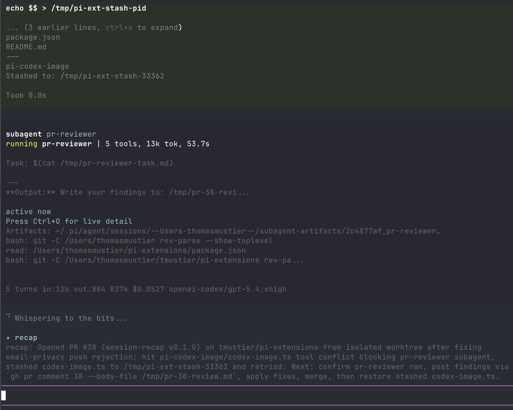

# pi-session-recap

"While you were away" recap for Pi, modelled on Claude Code's away-summary. Once explicitly enabled, when you've genuinely been away from a Pi session, a short recap is drafted while you're gone and parked at the end of the scrollable transcript in fullscreen TUI, or above the editor in regular TUI, so it's waiting when you return.



Built for multi-clauding / multi-pi workflows where several agent sessions run in parallel tabs.

The recap orients rather than reports: it states the high-level task first (what you're building or debugging), then the concrete next step — the last assistant message is already on screen; what you've lost after a context switch is the task thread.

**Privacy default: no recap provider requests.** Recaps use an independent provider request built from session history *before* Pi's request-local `context` hooks run. A hook that redacts secrets from the parent provider request does **not** redact this history. To deliberately send raw history to a specific physical model, start Pi with both `--recap-allow-raw-history` and `--recap-model "provider/model-id"` (for example, `--recap-model "anthropic/claude-haiku-4-5"`). Review that destination's data policy before opting in. Without both flags, `/recap` explains how to enable it; automatic triggers remain silent and make no provider request.

## How it triggers

1. **Away timer.** The extension enables terminal focus reporting (DECSET `?1004`) on session start. After the terminal has been continuously blurred for `--recap-away-seconds` (default 90s), a recap is generated and shown, so it's parked in the transcript (fullscreen) or above the editor (regular TUI) when you refocus.
2. **Agent settles while you're away.** Once retries, compaction recovery, and queued follow-ups finish while the terminal is blurred — the prime multi-tab moment — a recap is drafted after a three-second debounce, even if the away threshold has not elapsed. The pending away timer cannot cut this debounce short.
3. **Idle fallback.** Only on terminals that haven't demonstrated focus-reporting support: `--recap-idle-seconds` (default 120s) after the agent settles with no input, a recap is generated anyway. The first real focus event disarms this path for the session.

Also fires automatically on `/resume` and `/fork` so you know where the prior session left off.

The temporary recap clears when you type, new agent work begins, you successfully navigate the session tree, or the session is replaced. It is not saved in session history or sent to the model.

Quick alt-tabs without a settled agent cost nothing before the away threshold. If an agent settles while you're blurred, returning before its three-second debounce cancels that recap; otherwise it may draft sooner than the away threshold. If you return while a recap is already drafting, it's allowed to finish — it lands moments after you're back.

## Terminal compatibility

| Terminal | Focus reporting | Notes |
|---|---|---|
| iTerm2, Ghostty, Alacritty, Kitty, WezTerm, xterm | ✅ | Works out of the box. |
| VS Code integrated terminal, Warp | ✅ | Works. |
| Apple Terminal | ⚠️ Partial | Idle fallback covers it. |
| tmux | ✅ (with config) | Add `set -g focus-events on` to `~/.tmux.conf`, then `tmux source-file ~/.tmux.conf`. |

If focus events cause any weirdness in your terminal, run with `--recap-disable-focus` and the idle fallback still works.

## Model

The recap uses **only** the explicitly named `--recap-model "provider/model-id"` destination and its authentication, after `--recap-allow-raw-history` is set. It never silently selects a cheaper model or falls back to the active model if the target is missing or unavailable. The destination may differ from the active provider; the consent flags authorize sending the unredacted history to that named destination. If authentication resolves a different `baseUrl` than the selected model's registered endpoint, the recap is skipped **before any provider request**: a model name alone cannot authorize that different physical destination. `/recap` warns; automatic recaps stay quiet. Providers that rely on credential-specific endpoint overrides (for example, some enterprise configurations) cannot recap until the registered and authenticated endpoints match.

With a Pi 0.99+ virtual model selected, the override must still name a concrete physical model. Pi routes virtual models per request, but this extension's standalone completion cannot route them or guarantee reasoning is off if the router chooses Codex. Invalid or virtual targets are skipped (with an actionable `/recap` warning, but no automatic notification). Changing the active model or recap target during pending authentication cancels that pending dispatch.

The recap sends no system prompt, tools, or Agent Skills, and never writes to the prompt cache. Reasoning is always off: most APIs disable thinking when no reasoning level is requested, while Codex models receive an explicit `reasoningEffort: "none"`. On Pi 0.87+, it uses up to 30 recent messages from Pi's pre-hook projected session context (plus a user boundary if needed), the earliest non-omitted user request on the active branch, and the active compaction or branch summary. Incomplete assistant turns and orphaned or duplicate tool results do not consume the recent window. When a large result run crosses the window, the recap keeps its assistant call with the newest paired results within the bound. Context edits to the initial request are honored, including replacement and omission. On older supported Pi hosts without projections, it uses their compaction-aware context entries with the same recent-window treatment. Large initial requests and individual tool results retain their beginning and end.

Custom providers work when they use a built-in pi-ai API type. Pi-only custom handlers are skipped because the standalone compatibility layer cannot route them; select a supported physical model as the recap destination.

### Upstream attribution

The fullscreen transcript placement and explicit Codex reasoning-off behavior are derived from [tmustier/pi-extensions `session-recap` v0.5.0](https://github.com/tmustier/pi-extensions/tree/09706a7/session-recap). Projected-context recaps and settlement handling follow [upstream v0.5.1](https://github.com/tmustier/pi-extensions/tree/4a63a2e/session-recap), adapted here for older Pi hosts, branch ownership, model selection, authentication checks, and bounded native-message context.

## Install

### Pi package manager

```bash
pi install npm:@signalridge/pi-session-recap
```

Filter to just this extension in `~/.pi/agent/settings.json`:

```json
{
  "packages": [
    {
      "source": "npm:@signalridge/pi-session-recap",
      "extensions": ["index.ts"]
    }
  ]
}
```

### Local clone

```json
{
  "extensions": [
    "./packages/pi-session-recap/index.ts"
  ]
}
```

## Flags

| Flag | Default | Description |
|---|---|---|
| `--recap-away-seconds <n>` | `90` | Seconds of continuous terminal blur before an away recap is generated. |
| `--recap-idle-seconds <n>` | `120` | Idle-fallback delay after `agent_settled`, used only when the terminal doesn't report focus. |
| `--recap-disable-focus` | `false` | Disable DECSET `?1004` focus reporting. Idle fallback still runs. |
| `--recap-during-active` | `false` | Allow away recaps while an agent turn is still running, instead of deferring to the end of the turn. |
| `--recap-disable` | `false` | Disable the automatic recap entirely. `/recap` still works. |
| `--recap-allow-raw-history` | `false` | Explicitly allow unredacted session history to be sent to the named recap model. Required for `/recap` and automatic recaps. |
| `--recap-model "<p/id>"` | unset | Required physical provider/model destination, e.g. `anthropic/claude-haiku-4-5`; without it no recap is sent. |

## Command

| Command | Description |
|---|---|
| `/recap` | Generate a recap now (bypasses the activity gate but still requires both privacy flags); otherwise show setup guidance. |

## License

MIT
