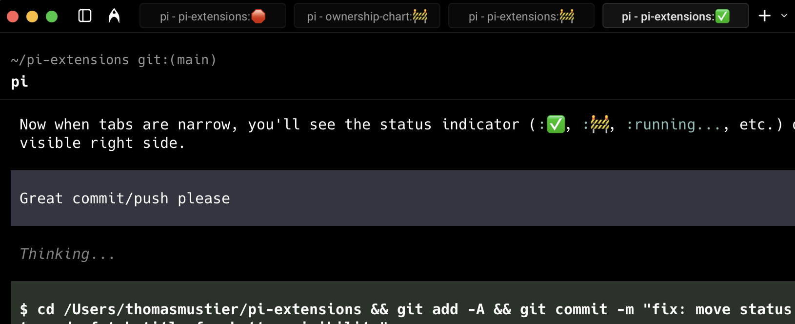

# pi-tab-status

Manage as many parallel Pis as your mind can handle without forgetting any of them.

Adds a compact status to tab titles:

- The optional `ridgeline` style uses `pi · project · working|done|review|blocked`.
- The default `legacy` style keeps the original emoji indicators: ✅ committed, 🚧 review needed, 🛑 blocked/error, and `running...` while active.
- `blocked` means no messages or tool calls for 180s while running, or an agent error.

The more tabs you have open, the better it is. **Currently tracks one active session per tab.**



## Install

### Pi package manager

```bash
pi install npm:@signalridge/pi-tab-status
```

```bash
pi install npm:@signalridge/pi-tab-status
```

Then filter to just this extension in `~/.pi/agent/settings.json`:

```json
{
  "packages": [
    {
      "source": "npm:@signalridge/pi-tab-status",
      "extensions": ["tab-status.ts"]
    }
  ]
}
```

### Local clone

```bash
ln -s "$(pwd)/packages/pi-tab-status/tab-status.ts" ~/.pi/agent/extensions/
```

Or add to `~/.pi/agent/settings.json`:

```json
{
  "extensions": ["./packages/pi-tab-status/tab-status.ts"]
}
```

Set the original Signalridge style with:

```sh
PI_TAB_STATUS_STYLE=ridgeline
```

The environment variable is user-overridable; the package still defaults to the legacy style when it is unset.

## Todo

- [x] Status indicators in terminal tabs
- [ ] Central location to view and navigate to specific tabs across terminal windows

## Changelog

See `CHANGELOG.md`.
